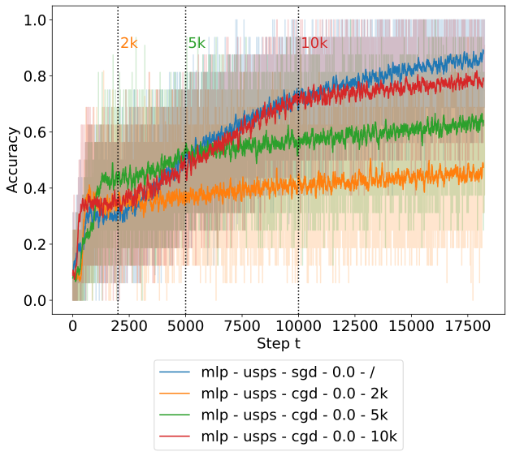

# Chaotic Dynamics are Intrinsic to Neural Network Training with SGD

Welcome to the repository of our NeurIPS 2022 paper "Chaotic Dynamics are Intrinsic to Neural Network Training with SGD"

This repository is structured in two subfolders: A folder `o2grad`, containing the O2Grad package and a folder `experiments`,
containing the files used to run the experiments in the respective section of the paper.

To reproduce the experiments, you will need to go through the following 3 steps:
## 1. Setup the Python environment
Recreate the Python virtual environment by entering in a terminal from inside the repository root folder:
```bash
> python -m venv .chaotic_nips22
> pip install -r requirements.txt
```

If you prefer conda for package management, we highly recommend you use [mamba](https://mamba.readthedocs.io/en/latest/installation.html) to install the dependencies. Install by running
```bash
> conda install mamba -n base -c conda-forge
> mamba env create -f environment.yml
```

## 2. Setup O2Grad
Setup the `o2grad` package by running from a terminal inside the repository root folder:
```bash
> cd o2grad
> python setup.py develop
```
### 2.1 If you're experiencing problems with the installation
Here is a list of the main dependencies:
```
pip install torch==1.11.0+cu113 torchvision==0.12.0+cu113 torchaudio==0.11.0 -f https://download.pytorch.org/whl/torch_stable.html
pip install torch-scatter torch-sparse -f https://data.pyg.org/whl/torch-1.11.0+cu113.html
pip install hydra-core --upgrade
pip install neptune-client
pip install pytorch-lightning
pip install matplotlib
```
Be sure to choose the right cudatoolkit for Pytorch for the cuda version on the GPU if you plan to run experiments on GPU.

## 3. Rerun the experiments
Finally, you will need to modify `train.py` in `experiments/` to suit your needs. We provide two logging options: Neptune.ai (recommended) or Tensorboard. Assuming you have an account on
[neptune.ai](https://https://neptune.ai), the simplest solution would be to replace the following lines in `train.py`:

#L108-109 in `train.py`:
```
# api_key='XXXX',
project='username/project_name',
```

with your own Neptune API key and your own project name to log your experiments there.

Start an experiment by running `train.py` with the following options (as defined in `experiments/config`):

| Option          | Description                                                 |
|-----------------|-------------------------------------------------------------|
| **Main** |
| dataset         | Default: `'usps'`. Choose `'usps'` or `'fmnist'` as dataset |
| batch_size      | Default: `8`. Define the batch size                         |
| max_epochs      | Default: `40`. Define the number of epochs of the run       |
| gpus            | Default: `[]`. GPUs to use, e.g `'cuda:0'`                  |
| parallel        | Default: 1. How many models to run in parallel (not utilized for current experiments)  |
| perturb_strat   | Default: None. Define strategy for perturbation, e.g. 'max_chaos' or 'all' to do all 5 at once |
| perturb_eps     | Default: [1e-1]. List of epsilons of model perturbations    |
| eps_eigh        | Default: 0.0. If >0, stabilizes eigh calculation of matrices A by adding A + eps_eigh * I
| eigenthings_path| Default: None. Path from which to reload stored eigenthings |
| seed            | Default: None. If provided, will load model with seed specified |
| debug           | Default: False. If set, toggles debugging options and dataset |
| **Logging** |
| log_eigenthings | Default: True. Logs eigenpairs and related info |
| log_lyapunov    | Default: True. Logs eigenpairs of Lyapunov matrix |
| log_subsim      | False. Logs subspace similarity of the hessian |
| log_lyapunov_subsim | Default: False. Log subspace similarity for global chaos directions |
| log_freq        | Default: 1. Log metrics every log_freq step. We suggest using 10 for subsim experiments  |
| plot_eigs_every | Default: 0. After how many steps to log plots of eigenvalue spectra |
| plot_mats_every | Default: 0. After how many steps to log plots of matrices |
| plot_trajectories | Default: False. If true, will plot chaotic trajectories |
| save_eigenthings | Default: False. Save lyapunov eigenspectrum after training |
| save_lyapunov_at | Default: None. Epoch at which to store the Lyapunov matrix |
| offline          | Default: False. Disables logging on neptune |
| t_lya_subsim     | Default: None. Disables Subsim else give list of timesteps t_0 to fix subspace and compare with later ones |
| lyapunov_perturb_vecs | Default: None. Define path for lyapunov eigenvectors for perturbation |
| lyapunov_perturb_vals | Default: None. Define path for lyapunov eigenvalues for perturbation |
| save_hessian_dist_every | Default: 0. Set to zero for not saving the eigenvals of the hessian every n steps |
| signal_noise_window | Default: 0. Set to zero for not saving the signal noise |
| logger_type       | Default: 'neptune'. Either 'neptune' or 'tensorboard' |
| tags              | Default: []. Flags to use for logging |
| **Model** |
| **name**          | If: 'cnn'. The following two options are specific to CNNs |
| base_channels     | Default: 4. Base dimension of the CNN channels |
| block_cnt         | Default: 1. Number of -> conv -> activation -> blocks in CNN |
| activation        | Default: 'relu'. |
| **name**          | Default: 'mlp'. The following option is specific to MLPs |
| inter_dim         | Default: 20. Output dimension of the first linear layer |
| **Optim** |
| **name**      | Default: 'sgd'. Either sgd or cgd |
| momentum      | Default: 0. Momentum to use for SGD or CGD optimizer |
| lr            | Default: 0.001. Trainer learning rate |
| **name**      | If: 'cgd'. Either sgd or cgd. The following options are specific to CGD |
| k             | Default: None. If optimizer is cgd, will only prune k eigenvalues|
| prune_global  | Default: False. If set, will first train the model normally and then prune it using the directions provided |
| prune_global_checkpoint  | Default: None. If set, will prune directions provided in checkpoint |
| prune_set     | Default: 'chaotic'. Set of Hessian eigenvalues from which to prune |
| prune_k       | Default: 'top_abs'. Pruning rule |
| prune_start   | Default: 0. The step at which to start pruning |
| noise         | Default: False. Will generate random noise on pruned dimensions instead of pruning |
| noise_fac     | Default: None. Level of noise to use on pruned dimensions |


## Examples:

### 3.1. Pruning Experiments
By default, the experiments will run with regular SGD. To rerun the pruning experiments, you need to use the CGD optimizer. As an example, if you want to use pruning of the top magnitude components of the negative spectrum for the MLP model and log metrics related to the Lyapunov matrix, you could do this as
```
train.py model.name=mlp optim=cgd optim.k=100 optim.prune_set=neg logging.log_lyapunov=True
```
For a full overview of the parameters that can be adapted in the CGD optimizer, see `experiments/config/optim/cgd.yaml`.

### 3.2 Distance Experiments
For the distance experiments you need to run a single training with SGD with Lyapunov calculation first:
```
train.py save_eigenthings='True' seed=42
```
And then load the respective eigenvectors file that was created after training in `'./storage/..'`. Define perturbation magnitudes and strategies as follows (perturb_strat='all' for all different strategies at once). Use the same seed!
```
train.py seed=42 model=mlp dataset=usps logging.log_eigenthings=False logging.log_lyapunov=False logging.lyapunov_perturb_eigs='path/to/save' perturb_eps=[1e-1] perturb_strat='all' parallel=5
```
This will train multiple models in parallel thus calculating the Lyapunov matrix here is not recommended.

### 3.3. Subspace Similarities
For a the subspace similarity experiment with a CNN without momentum on USPS, start the run with:

```
train.py model.name='cnn' logging.log_lyapunov_subsim=True logging.t_lya_subsim=[10,1e+4]
```

### 4. Experiment Table

|  |
|:--:|
| Figure 2a from the paper. |

Below, we provide an experiment table with detailed commands for running the experiments used to generate all figures used in the main paper:


|     Figure     |  Label | Command  |
|----------|---|---|
| Figure 1 | mlp - usps - sgd - 0.0 - / | `train.py model=mlp dataset=usps optim=sgd optim.momentum=0.0` |
| Figure 1 | mlp - usps - cgd - 0.0 - chaotic | `train.py model=mlp dataset=usps optim=cgd optim.momentum=0.0 prune_set=chaotic` |
| Figure 1 | mlp - usps - cgd - 0.0 - pos | `train.py model=mlp dataset=usps optim=cgd optim.momentum=0.0 prune_set=pos` | ´
| Figure 1 | mlp - usps - cgd - 0.0 - neg | `train.py model=mlp dataset=usps optim=cgd optim.momentum=0.0 prune_set=neg` |
| | | |
| Figure 2 | mlp - usps - sgd - 0.0 - / | `train.py model=mlp dataset=usps optim=sgd optim.momentum=0.0` |
| Figure 2 | mlp - usps - cgd - 0.0 - 2k | `train.py model=mlp dataset=usps optim=sgd optim.momentum=0.0 prune_start=2000` |
| Figure 2 | mlp - usps - cgd - 0.0 - 5k | `train.py model=mlp dataset=usps optim=sgd optim.momentum=0.0 prune_start=5000` |
| Figure 2 | mlp - usps - cgd - 0.0 - 10k | `train.py model=mlp dataset=usps optim=sgd optim.momentum=0.0 prune_start=10000` |
| | | |
| Figure 3a | usps - mlp - 0.0 | `train.py seed=42 model=mlp dataset=usps logging.log_eigenthings=False logging.log_lyapunov=False logging.lyapunov_perturb_eigs='path/to/save' perturb_eps=[1e-1] perturb_strat='all' parallel=5`|
| Figure 3a | fmnist - mlp - 0.0 | `train.py seed=42 model=mlp dataset=fmnist logging.log_eigenthings=False logging.log_lyapunov=False logging.lyapunov_perturb_eigs='path/to/save' perturb_eps=[1e-1] perturb_strat='all' parallel=5`|
| | | |
| Figure 3b | mlp - usps - 0.0 | Use the distance data from above and the function ```fit_theoretical_bound``` from ```experiments.utils```. The minimal and maximal Lyapunov exponents are created in the run that saved the eigenvalues. Use the same seed for both runs.|
